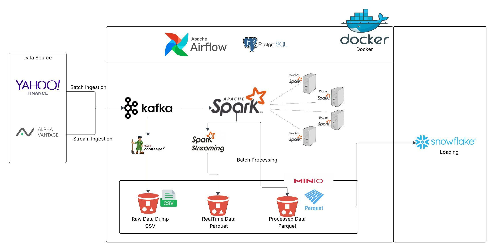
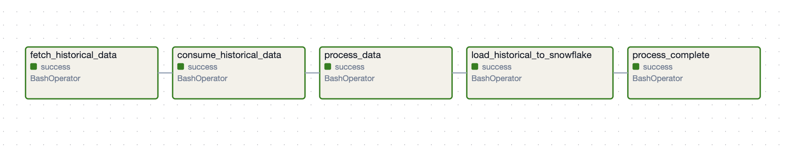
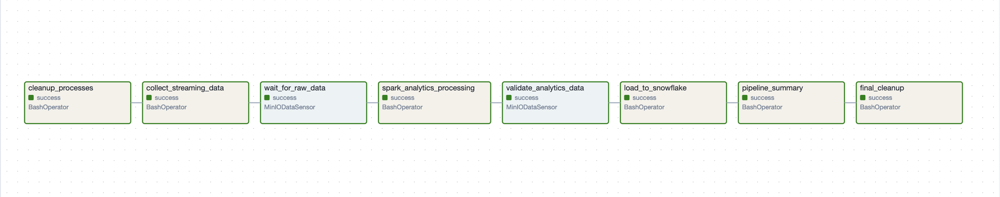

# Stock Market Data Pipeline

⚡ **Enterprise-grade end-to-end data engineering project** that processes real-time and historical stock market data. Built with **Kafka, Spark, Airflow, MinIO, Snowflake, and Docker**, it demonstrates modern streaming + batch architectures. The pipeline ingests, transforms, and loads data into a **cloud warehouse** for analytics and reporting. Includes **scalable orchestration, fault tolerance, and data quality checks**, making it **production-ready and portfolio-worthy**.



## 🚀 Quick Start
```bash
git clone https://github.com/your-username/stock-market-data-pipeline.git
cd stock-market-data-pipeline
docker-compose up -d
```
**Access Points:** Airflow UI (localhost:8080) | MinIO Console (localhost:9001) | Kafka UI (localhost:8081)

For detailed setup instructions, see [Setup / Installation](#setup--installation).

---

## Table of Contents
1. [Overview](#overview)  
2. [Motivation / Problem Statement](#motivation--problem-statement)  
3. [Architecture](#architecture)  
4. [Tech Stack](#tech-stack)  
5. [Features](#features)  
6. [Setup / Installation](#setup--installation)  
7. [Usage / Running the Pipeline](#usage--running-the-pipeline)  
8. [Data Flow](#data-flow)  
9. [Folder Structure](#folder-structure)  
10. [Examples / Screenshots](#examples--screenshots)  
11. [Testing & Quality Assurance](#testing--quality-assurance)  
12. [Future Improvements / Roadmap](#future-improvements--roadmap)  
13. [Contributing](#contributing)  
14. [License](#license)

---

## Overview

The **Stock Market Data Pipeline** is a comprehensive, production-ready analytics platform that demonstrates modern data engineering best practices for processing financial market data. This system handles both real-time streaming data and historical batch processing, implementing a complete end-to-end data pipeline from ingestion to analytics-ready storage.

The platform ingests stock market data through dual pathways: real-time streaming for live market analysis and batch processing for historical data analysis. All data flows through Apache Kafka for reliable message streaming, gets processed using Apache Spark for both streaming and batch transformations, stores intermediate and final results in MinIO (S3-compatible storage), and loads analytics-ready datasets into Snowflake for business intelligence and reporting.

Built with containerized microservices using Docker, the entire system is orchestrated through Apache Airflow, ensuring reliable, scalable, and maintainable data operations suitable for production financial analytics environments.

---

## Motivation / Problem Statement

Modern financial markets generate massive volumes of data at unprecedented speeds, creating significant challenges for traditional data processing approaches:

**Real-time Market Analysis Challenges:**
- Stock prices change multiple times per second, requiring sub-second processing capabilities
- Traditional batch processing introduces unacceptable latency for trading decisions
- Market volatility analysis requires sliding window calculations over streaming data
- Integration of multiple data sources (real-time feeds + historical data) is complex

**Scalability and Reliability Requirements:**
- Financial data cannot tolerate data loss or processing failures
- Systems must scale to handle market open/close volume spikes
- Data lineage and audit trails are mandatory for regulatory compliance
- Infrastructure must support both exploratory analytics and production trading systems

**Existing Solutions Gaps:**
- Most market data platforms are proprietary and expensive
- Open-source solutions often lack enterprise-grade reliability features
- Limited integration between real-time and batch processing systems
- Complex setup and maintenance requirements for multi-technology stacks

This project addresses these challenges by implementing a modern data architecture that combines the reliability of batch processing with the speed of real-time streaming, using open-source technologies in a production-ready configuration.

---

## Architecture


The pipeline implements a **Lambda Architecture** pattern, handling both batch and streaming data paths:

### Core Components Integration:

**Data Ingestion Layer:**
- **Yahoo Finance API** serves as the primary data source for both real-time and historical stock data
- **Alpha Vantage API** provides additional market data and serves as a backup data source
- **Kafka Producers** (`stream_data_producer.py`, `batch_data_producer.py`) ingest data into separate Kafka topics

**Message Streaming:**
- **Apache Kafka** manages two primary topics:
  - `stock-market-realtime`: Handles live market data with 30-second intervals
  - `stock-market-batch`: Processes historical data for bulk ingestion
- **ZooKeeper** coordinates Kafka cluster operations and maintains topic metadata

**Data Processing Engine:**
- **Apache Spark** processes data through multiple pathways:
  - **Spark Structured Streaming** (`spark_stream_batch_processor.py`) handles real-time analytics
  - **Spark Batch Processing** (`spark_batch_processor.py`) manages historical data transformations
  - Implements sliding window calculations (15-minute and 1-hour windows)
  - Calculates moving averages, volatility metrics, and volume aggregations

**Storage Layer:**
- **MinIO** (S3-compatible) provides distributed object storage:
  - `raw/` bucket stores unprocessed data partitioned by date
  - `processed/` bucket contains analytics-ready Parquet files partitioned by symbol
- **Snowflake** serves as the data warehouse for analytics and reporting

**Orchestration:**
- **Apache Airflow** orchestrates the entire pipeline:
  - `stock_market_batch_dag.py`: Daily batch processing workflow
  - `stock_market_stream_dag.py`: Real-time streaming pipeline management
  - Custom sensors monitor data availability and trigger downstream processing

**Infrastructure:**
- **Docker Compose** containerizes all services for consistent deployment
- **PostgreSQL** serves as Airflow's metadata database
- All components run in isolated containers with defined networking

### Design Decisions:

**Streaming vs Batch Processing:**
- **Streaming Path**: Optimized for low-latency market analysis (< 1 minute processing time)
- **Batch Path**: Handles large historical datasets and complex aggregations
- **Converged Processing**: Both paths use identical Spark transformation logic for consistency

**Data Partitioning Strategy:**
- **Time-based partitioning** (`year/month/day/hour`) for efficient data lifecycle management
- **Symbol-based partitioning** in processed data for optimized analytics queries
- **Parquet format** with Snappy compression for optimal storage and query performance

---

## Tech Stack

### Core Technologies:
- **Apache Kafka 2.8** - Distributed event streaming platform
- **Apache Spark 3.3** - Unified analytics engine (Structured Streaming & Batch)
- **Apache Airflow 2.5** - Workflow orchestration and scheduling
- **MinIO** - S3-compatible object storage for data lake
- **Snowflake** - Cloud data warehouse for analytics
- **Docker & Docker Compose** - Containerization and orchestration

### Data Processing:
- **Python 3.9+** - Primary programming language
- **PySpark** - Python API for Apache Spark
- **Pandas** - Data manipulation and analysis
- **Confluent Kafka Python** - Kafka client library
- **Snowflake Connector** - Python connector for Snowflake

### Data Sources:
- **Yahoo Finance API** (`yfinance`) - Real-time and historical stock data
- **Alpha Vantage API** - Additional market data source

### Development & Operations:
- **Apache ZooKeeper** - Distributed coordination service
- **PostgreSQL** - Metadata database for Airflow
- **Boto3** - AWS SDK for S3/MinIO interactions
- **NumPy** - Numerical computing library

### Monitoring & Logging:
- **Python Logging** - Comprehensive logging throughout the pipeline
- **Airflow UI** - Pipeline monitoring and management
- **Spark UI** - Job monitoring and performance tuning

---

## Features

### Data Ingestion Capabilities:
- **Real-time Stock Data Streaming**: Live market data with 30-second intervals
- **Historical Data Batch Processing**: Complete historical datasets (1+ years)
- **Multi-source Data Integration**: Yahoo Finance and Alpha Vantage APIs
- **Fault-tolerant Kafka Integration**: Guaranteed message delivery with consumer groups

### Advanced Analytics Processing:
- **Real-time Moving Averages**: 5, 15, and 30-period calculations
- **Volatility Analysis**: Standard deviation calculations over sliding windows
- **Volume Analytics**: Aggregated trading volume metrics
- **Time Window Processing**: 15-minute and 1-hour sliding windows
- **Symbol-based Partitioning**: Optimized storage for per-stock analysis

### Data Storage & Management:
- **Multi-format Storage**: CSV for raw data, Parquet for analytics
- **Intelligent Partitioning**: Date and symbol-based partitioning strategies
- **Data Lake Architecture**: Hierarchical storage in MinIO
- **Data Warehouse Integration**: Incremental loading to Snowflake
- **Schema Evolution Support**: Flexible schema handling for data changes

### Pipeline Orchestration:
- **Automated Scheduling**: Daily batch processing and continuous streaming
- **Dependency Management**: Task dependencies and data availability sensors
- **Error Handling & Retries**: Robust failure recovery mechanisms
- **Resource Management**: Optimized Spark configurations for performance
- **Pipeline Monitoring**: Comprehensive logging and status tracking

### Production-Ready Features:
- **Containerized Deployment**: Docker-based microservices architecture
- **Scalable Processing**: Configurable Spark cluster resources
- **Data Quality Checks**: Schema validation and data integrity monitoring
- **Incremental Processing**: Efficient updates and upserts
- **Environment Configuration**: Flexible configuration via environment variables

---

## Setup / Installation

### Prerequisites:
- **Docker** (version 20.10+) and **Docker Compose** (version 2.0+)
- **Python 3.9+** for local development
- **Snowflake Account** with warehouse access (optional for full pipeline)
- **Minimum System Requirements**: 8GB RAM, 4 CPU cores, 20GB disk space

### Quick Setup:

```bash
# 1. Clone and navigate
git clone https://github.com/your-username/stock-market-data-pipeline.git
cd stock-market-data-pipeline

# 2. Configure environment (edit as needed)
cp .env.example .env

# 3. Start all services
docker-compose up -d

# 4. Verify services
docker-compose ps
```

**Service URLs:**
- **Airflow UI**: http://localhost:8080 (admin/admin)
- **MinIO Console**: http://localhost:9001 (minioadmin/minioadmin)
- **Kafka UI**: http://localhost:8081
- **Spark Master UI**: http://localhost:4040

### Detailed Configuration:

<details>
<summary>Click to expand full setup instructions</summary>

**Required Environment Variables:**
```bash
# Kafka Configuration
KAFKA_BOOTSTRAP_SERVER=kafka:9092
KAFKA_TOPIC_REALTIME=stock-market-realtime
KAFKA_TOPIC_BATCH=stock-market-batch

# MinIO Configuration
MINIO_ACCESS_KEY=minioadmin
MINIO_SECRET_KEY=minioadmin
MINIO_BUCKET=stock-market-data

# Snowflake Configuration (Optional)
SNOWFLAKE_ACCOUNT=your-account
SNOWFLAKE_USER=your-username
SNOWFLAKE_PASSWORD=your-password
SNOWFLAKE_DATABASE=STOCKMARKETBATCH
SNOWFLAKE_WAREHOUSE=COMPUTE_WH

# API Keys (Optional for extended data sources)
ALPHA_VANTAGE_API_KEY=your-api-key
```

3. **Install Python Dependencies:**
```bash
# Create virtual environment
python -m venv venv
source venv/bin/activate  # On Windows: venv\Scripts\activate

# Install dependencies
pip install -r requirements.txt
```

4. **Initialize Infrastructure:**
```bash
# Start all services
docker-compose up -d

# Verify services are running
docker-compose ps

# Check service logs
docker-compose logs -f
```

5. **Service Access URLs:**
- **Airflow UI**: http://localhost:8080 (admin/admin)
- **MinIO Console**: http://localhost:9001 (minioadmin/minioadmin)
- **Kafka UI**: http://localhost:8081
- **Spark Master UI**: http://localhost:4040

### Initial Setup Verification:
```bash
# Check Kafka topics
docker exec -it kafka kafka-topics --list --bootstrap-server localhost:9092

# Verify MinIO buckets
# Access MinIO console and ensure 'stock-market-data' bucket exists

# Test Airflow connection
curl -X GET "http://localhost:8080/api/v1/dags" \
  -u "admin:admin"
```

</details>

---

## Usage / Running the Pipeline

### Starting the Complete Pipeline:

1. **Initialize All Services:**
```bash
# Start the entire infrastructure
docker-compose up -d

# Monitor initialization logs
docker-compose logs -f
```

2. **Access Airflow Dashboard:**
   - Navigate to http://localhost:8080
   - Login with admin/admin
   - Enable the DAGs: `stock_market_batch_pipeline` and `stock_streaming_pipeline`

### Running Batch Processing:

**Automatic Execution:**
```bash
# The batch DAG runs daily at scheduled time
# Monitor progress in Airflow UI
```

**Manual Trigger:**
```bash
# Via Airflow UI: Click on DAG → Trigger DAG
# Or via CLI:
docker exec -it airflow-webserver airflow dags trigger stock_market_batch_pipeline
```

**Batch Pipeline Steps:**
1. `fetch_historical_data` - Downloads historical stock data
2. `consume_historical_data` - Processes Kafka messages to MinIO
3. `process_data` - Spark batch processing and transformations
4. `load_historical_to_snowflake` - Loads processed data to Snowflake
5. `process_complete` - Pipeline completion notification

### Running Streaming Processing:

**Automatic Execution:**
```bash
# Streaming DAG runs on schedule (every 30 minutes default)
# Monitor in Airflow UI under 'stock_streaming_pipeline'
```

**Manual Trigger:**
```bash
# Trigger streaming pipeline
docker exec -it airflow-webserver airflow dags trigger stock_streaming_pipeline
```

**Streaming Pipeline Steps:**
1. `cleanup_processes` - Cleans any existing streaming processes
2. `collect_streaming_data` - Runs producer/consumer for 3 minutes
3. `wait_for_raw_data` - Sensor waits for data availability
4. `spark_analytics_processing` - Real-time analytics processing
5. `validate_analytics_data` - Validates processed data
6. `load_to_snowflake` - Loads streaming analytics to Snowflake
7. `pipeline_summary` - Generates execution summary
8. `final_cleanup` - Cleanup and resource management

### Monitoring Pipeline Execution:

**Check Data Flow:**
```bash
# Monitor Kafka topics
docker exec -it kafka kafka-console-consumer \
  --bootstrap-server localhost:9092 \
  --topic stock-market-realtime \
  --from-beginning

# Check MinIO data
# Access http://localhost:9001 and browse stock-market-data bucket

# Monitor Spark jobs
# Access http://localhost:4040 when Spark jobs are running
```

**Pipeline Status:**
```bash
# Check Airflow task status
docker exec -it airflow-webserver airflow tasks list stock_market_batch_pipeline

# View task logs
docker exec -it airflow-webserver airflow tasks logs stock_market_batch_pipeline fetch_historical_data 2024-01-01
```

### Troubleshooting Common Issues:

**Service Connection Issues:**
```bash
# Restart specific services
docker-compose restart kafka
docker-compose restart spark-master

# Check service health
docker-compose ps
docker-compose logs service-name
```

**Data Processing Issues:**
```bash
# Check Spark application logs
docker logs stockmarketdatapipeline-spark-master-1

# Verify data in MinIO
# Check bucket contents in MinIO console

# Test Snowflake connection
python src/snowflake/scripts/test_connection.py
```

---

## Data Flow

### Complete Data Journey:

**1. Data Sources → Kafka Ingestion:**
```
Yahoo Finance API → stream_data_producer.py → Kafka Topic (stock-market-realtime)
Alpha Vantage API → batch_data_producer.py → Kafka Topic (stock-market-batch)
```

**2. Kafka → MinIO Raw Storage:**
```
Kafka Topics → Consumer Scripts → MinIO/raw/
├── realtime/year=2024/month=01/day=15/hour=14/stock_data_20240115_1430.csv
└── historical/year=2024/month=01/day=15/AAPL_143022.csv
```

**3. MinIO Raw → Spark Processing:**
```
MinIO/raw/ → Spark Jobs → Transformations:
├── Moving Averages (5, 15, 30 periods)
├── Volatility Calculations (15min, 1hour windows)
├── Volume Aggregations
└── Time Window Analytics
```

**4. Spark → MinIO Processed Storage:**
```
Spark Output → MinIO/processed/
├── realtime/year=2024/month=01/day=15/symbol=AAPL/part-*.parquet
├── realtime/year=2024/month=01/day=15/symbol=MSFT/part-*.parquet
└── historical/date=2024-01-15/symbol=GOOGL/part-*.parquet
```

**5. MinIO → Snowflake Analytics:**
```
MinIO/processed/ → Snowflake Loaders → Data Warehouse:
├── STOCKMARKETBATCH.PUBLIC.DAILY_STOCK_METRICS (Historical Data)
└── STOCKMARKETSTREAM.PUBLIC.REALTIME_STOCK_ANALYTICS (Streaming Data)
```

### Data Transformations:

**Real-time Stream Processing:**
- **Input**: Raw stock prices, volumes, timestamps
- **Sliding Windows**: 15-minute and 1-hour overlapping windows
- **Calculations**: 
  - Moving averages with multiple timeframes
  - Price volatility (standard deviation)
  - Volume-weighted metrics
  - Technical indicators
- **Output**: Analytics-ready metrics partitioned by symbol and time

**Batch Historical Processing:**
- **Input**: Historical OHLCV (Open, High, Low, Close, Volume) data
- **Aggregations**: Daily summary statistics
- **Enrichments**: 
  - Price change calculations
  - Daily volatility metrics
  - Volume trend analysis
- **Output**: Daily stock metrics for business intelligence

### Data Quality & Lineage:

**Schema Validation:**
- Strict schema enforcement at Kafka ingestion
- Data type validation in Spark processing
- NULL value handling and imputation

**Data Lineage Tracking:**
- Batch IDs for traceability
- Processing timestamps at each stage
- Source system metadata preservation

**Quality Metrics:**
- Record count validation at each stage
- Data freshness monitoring
- Duplicate detection and handling

---

## Folder Structure

```
stockmarketdatapipeline/
├── README.md                           # Main project documentation
├── requirements.txt                    # Python dependencies
├── docker-compose.yml                 # Container orchestration
├── command.sh                          # Utility scripts
├── .env                               # Environment variables
│
├── data/                              # Data storage configuration
│   ├── kafka/                         # Kafka data persistence
│   ├── minio/                         # MinIO object storage
│   ├── spark/                         # Spark temporary data
│   └── zookeeper/                     # ZooKeeper coordination data
│
├── src/                               # Source code
│   ├── airflow/                       # Airflow DAGs and configuration
│   │   ├── dags/                      # Pipeline definitions
│   │   │   ├── scripts/               # Python processing scripts
│   │   │   │   ├── batch_data_producer.py      # Historical data ingestion
│   │   │   │   ├── batch_data_consumer.py      # Batch Kafka consumer
│   │   │   │   ├── stream_data_producer.py     # Real-time data producer
│   │   │   │   ├── realtime_data_consumer.py   # Streaming Kafka consumer
│   │   │   │   ├── load_to_snowflake.py        # Batch Snowflake loader
│   │   │   │   └── load_stream_to_snowflake.py # Streaming Snowflake loader
│   │   │   ├── stock_market_batch_dag.py       # Batch processing workflow
│   │   │   └── stock_market_stream_dag.py      # Streaming processing workflow
│   │   └── plugins/                   # Custom Airflow plugins
│   │
│   ├── kafka/                         # Kafka producers and consumers
│   │   ├── consumer/                  # Consumer implementations
│   │   │   ├── batch_data_consumer.py
│   │   │   └── realtime_data_consumer.py
│   │   └── producer/                  # Producer implementations
│   │       ├── batch_data_producer.py
│   │       └── stream_data_producer.py
│   │
│   ├── snowflake/                     # Snowflake integration scripts
│   │   └── scripts/
│   │       ├── load_stream_to_snowflake.py
│   │       └── load_to_snowflake.py
│   │
│   └── spark/                         # Spark processing jobs
│       └── jobs/
│           ├── spark_batch_processor.py        # Historical data processing
│           ├── spark_stream_batch_processor.py # Streaming analytics
│           └── spark_stream_processor.py       # Real-time stream processing
│
├── logs/                              # Application logs
├── reports/                           # Generated reports and analysis
│
├── docs/                              # Additional documentation
│   ├── project_description.md         # Detailed project description
│   └── design_notes.md               # Technical design decisions
│
├── images/                            # Diagrams and screenshots
│   ├── architecture.png              # System architecture diagram
│   └── workflow.png                  # Data flow diagram
│
└── readme_assets/                     # README supporting files
    └── example_queries.png            # Sample query screenshots
```

### Key Directory Purposes:

**`src/airflow/dags/`**: Contains the orchestration logic and workflow definitions
**`src/kafka/`**: Handles all message streaming operations
**`src/spark/jobs/`**: Core data processing and analytics transformations
**`src/snowflake/`**: Data warehouse integration and loading scripts
**`data/`**: Persistent data storage for all services
**`logs/`**: Centralized logging for debugging and monitoring

---

## Examples / Screenshots

### Architecture Overview

*Complete system architecture showing data flow from sources to analytics*

### Airflow DAG Visualization

*Batch processing workflow orchestrated by Airflow*


*Real-time streaming pipeline with custom sensors and cleanup*

### Spark Processing Dashboard

*Spark Structured Streaming job processing real-time market data*

### MinIO Data Lake Organization

*Hierarchical data organization in MinIO object storage*

### Sample Data Output

**Real-time Analytics Table (Snowflake):**
```sql
SELECT 
    symbol,
    window_start,
    ma_15m,
    ma_1h,
    volatility_15m,
    volume_sum_15m
FROM STOCKMARKETSTREAM.PUBLIC.REALTIME_STOCK_ANALYTICS
WHERE symbol = 'AAPL'
ORDER BY window_start DESC
LIMIT 5;
```

| symbol | window_start | ma_15m | ma_1h | volatility_15m | volume_sum_15m |
|--------|-------------|--------|-------|----------------|----------------|
| AAPL   | 2024-01-15 14:45:00 | 185.23 | 184.89 | 0.45 | 2,450,000 |
| AAPL   | 2024-01-15 14:30:00 | 185.01 | 184.67 | 0.52 | 2,890,000 |
| AAPL   | 2024-01-15 14:15:00 | 184.78 | 184.45 | 0.38 | 2,125,000 |

**Historical Batch Data (Snowflake):**
```sql
SELECT 
    symbol,
    date,
    daily_open,
    daily_high,
    daily_low,
    daily_close,
    daily_volume
FROM STOCKMARKETBATCH.PUBLIC.DAILY_STOCK_METRICS
WHERE symbol = 'MSFT'
ORDER BY date DESC
LIMIT 3;
```

| symbol | date | daily_open | daily_high | daily_low | daily_close | daily_volume |
|--------|------|------------|------------|-----------|-------------|--------------|
| MSFT   | 2024-01-15 | 350.25 | 352.89 | 349.12 | 351.67 | 25,890,000 |
| MSFT   | 2024-01-14 | 348.90 | 351.45 | 347.78 | 350.23 | 28,450,000 |
| MSFT   | 2024-01-13 | 346.12 | 349.78 | 345.89 | 348.95 | 22,760,000 |

### MinIO Data Organization
```
stock-market-data/
├── raw/
│   ├── realtime/year=2024/month=01/day=15/hour=14/
│   │   └── stock_data_20240115_1430.csv (125 records)
│   └── historical/year=2024/month=01/day=15/
│       ├── AAPL_143022.csv (365 records)
│       └── MSFT_143025.csv (365 records)
└── processed/
    ├── realtime/year=2024/month=01/day=15/
    │   ├── symbol=AAPL/part-00000.parquet
    │   └── symbol=MSFT/part-00000.parquet
    └── historical/date=2024-01-15/
        ├── symbol=AAPL/part-00000.parquet
        └── symbol=MSFT/part-00000.parquet
```

---

## Testing & Quality Assurance

### Data Quality Framework:

**Schema Validation:**
- Strict schema enforcement at Kafka ingestion points
- Pyspark DataFrame schema validation before processing
- Snowflake table constraint validation on data loads

**Data Integrity Checks:**
```python
# Example validation in processing scripts
def validate_stock_data(df):
    # Check for required columns
    required_cols = ['symbol', 'price', 'timestamp', 'volume']
    missing_cols = set(required_cols) - set(df.columns)
    if missing_cols:
        raise ValueError(f"Missing required columns: {missing_cols}")
    
    # Validate data ranges
    invalid_prices = df.filter(df.price <= 0).count()
    if invalid_prices > 0:
        logger.warning(f"Found {invalid_prices} records with invalid prices")
    
    # Check for future timestamps
    future_data = df.filter(df.timestamp > current_timestamp()).count()
    if future_data > 0:
        logger.error(f"Found {future_data} records with future timestamps")
```

**Pipeline Monitoring:**
- Comprehensive logging at each processing stage
- Record count validation between pipeline stages
- Data freshness monitoring with custom Airflow sensors
- Automated alerts for processing failures

### Error Handling & Recovery:

**Kafka Consumer Resilience:**
- Consumer group management for fault tolerance
- Configurable retry mechanisms with exponential backoff
- Dead letter queue handling for malformed messages

**Spark Job Recovery:**
- Checkpoint management for streaming jobs
- Automatic restart policies for failed batch jobs
- Resource allocation optimization to prevent OOM errors

**Airflow DAG Reliability:**
- Task retry configuration with intelligent backoff
- Sensor timeout handling for data availability
- Custom operators for complex error scenarios

### Testing Strategy:

**Unit Testing:**
```bash
# Run unit tests for data processing functions
python -m pytest tests/unit/

# Test Kafka producer/consumer functionality
python -m pytest tests/kafka/

# Validate Spark transformation logic
python -m pytest tests/spark/
```

**Integration Testing:**
```bash
# End-to-end pipeline testing
python -m pytest tests/integration/

# Test data warehouse connectivity
python -m pytest tests/snowflake/
```

**Data Quality Tests:**
```python
# Example data quality test
def test_no_duplicate_records():
    df = spark.read.parquet("s3a://stock-market-data/processed/realtime/")
    duplicates = df.groupBy("symbol", "window_start").count().filter("count > 1")
    assert duplicates.count() == 0, "Found duplicate records in processed data"
```

---

## Future Improvements / Roadmap

### Short-term Enhancements (Next 3 months):

**Monitoring & Alerting:**
- Implement Prometheus and Grafana for comprehensive monitoring
- Add custom metrics for data freshness and processing latency
- Configure PagerDuty integration for critical pipeline failures
- Build real-time dashboards for operational visibility

**Data Quality & Governance:**
- Implement Great Expectations for automated data quality testing
- Add data lineage tracking with Apache Atlas or similar
- Create data catalog with automated schema documentation
- Implement data retention policies and automated cleanup

**Performance Optimization:**
- Optimize Spark cluster resource allocation
- Implement dynamic scaling based on data volume
- Add caching layers for frequently accessed data
- Optimize Parquet file sizes and compression strategies

### Medium-term Goals (3-6 months):

**Advanced Analytics Features:**
- Real-time technical indicators (RSI, MACD, Bollinger Bands)
- Machine learning models for price prediction
- Anomaly detection for unusual trading patterns
- Real-time risk calculation and portfolio analytics

**Cloud Migration & Scalability:**
- Deploy on AWS/GCP with managed services (MSK, EMR, BigQuery)
- Implement auto-scaling for compute resources
- Add multi-region deployment for disaster recovery
- Migrate to managed Airflow (AWS MWAA or GCP Composer)

**Enhanced Data Sources:**
- Add alternative data sources (news sentiment, social media)
- Implement options and derivatives data processing
- Add cryptocurrency and forex data streams
- Integration with premium market data providers

### Long-term Vision (6+ months):

**Production-Grade Features:**
- Implement blue-green deployment strategies
- Add comprehensive backup and disaster recovery
- Create self-healing infrastructure with automated remediation
- Implement zero-downtime updates and migrations

**Business Intelligence & Analytics:**
- Build interactive dashboards with Tableau/PowerBI
- Implement real-time trading strategy backtesting
- Create automated report generation and distribution
- Add machine learning model serving infrastructure

**Enterprise Integration:**
- API layer for external system integration
- User authentication and role-based access control
- Audit logging and compliance reporting
- Integration with enterprise data governance tools

### Research & Innovation:

**Next-Generation Technologies:**
- Explore Apache Iceberg for better data lake management
- Investigate Kubernetes deployment with Helm charts
- Research delta lake implementations for ACID transactions
- Evaluate streaming ML with Apache Beam and TensorFlow

**Advanced Use Cases:**
- High-frequency trading data processing (microsecond latency)
- Graph analytics for market correlation analysis
- Real-time ESG scoring and sustainable investing metrics
- Integration with blockchain and DeFi protocols

---

## Contributing

We welcome contributions from the data engineering and financial analytics community! This project aims to demonstrate best practices while remaining accessible for learning and improvement.

### How to Contribute:

**Getting Started:**
1. Fork the repository and create a feature branch
2. Set up the development environment following the installation guide
3. Review open issues and project roadmap for contribution opportunities
4. Join our discussions in GitHub Issues for questions and ideas

**Development Workflow:**
```bash
# Clone your fork
git clone https://github.com/your-username/stock-market-data-pipeline.git
cd stock-market-data-pipeline

# Create feature branch
git checkout -b feature/your-feature-name

# Make changes and test thoroughly
docker-compose up -d
# Run your tests and validations

# Commit with descriptive messages
git commit -m "Add real-time anomaly detection feature"

# Push and create pull request
git push origin feature/your-feature-name
```

**Contribution Guidelines:**

**Code Quality Standards:**
- Follow PEP 8 style guidelines for Python code
- Add comprehensive docstrings for all functions and classes
- Include unit tests for new functionality
- Ensure all existing tests pass before submitting PR

**Documentation Requirements:**
- Update relevant documentation for new features
- Add inline comments for complex logic
- Update the README if adding new dependencies or setup steps
- Include example usage for new functionality

**Areas Where We Need Help:**
- **Data Sources**: Adding new financial data providers and APIs
- **Analytics**: Implementing advanced technical indicators and metrics
- **Testing**: Expanding test coverage and adding integration tests
- **Documentation**: Improving setup guides and troubleshooting documentation
- **Performance**: Optimizing Spark jobs and resource utilization
- **Monitoring**: Adding comprehensive observability and alerting

**Code Review Process:**
1. All contributions require peer review before merging
2. Automated CI/CD checks must pass (code quality, tests, security)
3. Maintainers will provide feedback within 48 hours
4. Breaking changes require discussion in GitHub Issues first

### Community Standards:

**Communication:**
- Be respectful and inclusive in all interactions
- Use clear, descriptive language in issues and PRs
- Help others learn by explaining your technical decisions
- Share knowledge and best practices from your experience

**Technical Standards:**
- Prioritize security and data privacy in all implementations
- Follow infrastructure-as-code principles for reproducible deployments
- Maintain backward compatibility when possible
- Document all configuration changes and deployment procedures

### Recognition:

**Contributors will be recognized through:**
- GitHub contributor acknowledgments
- Documentation credits for significant improvements
- Feature attribution in release notes
- Invitation to join the core maintainer team for consistent contributors

---

## License

This project is licensed under the **MIT License** - see the [LICENSE](LICENSE) file for details.

**Quick Summary:** ✅ Commercial use, modification, and distribution allowed | ❌ No warranty provided

**Important:** For production deployments, ensure compliance with third-party licenses (Apache 2.0 for Kafka/Spark/Airflow, AGPLv3 for MinIO). See [LICENSE](LICENSE) for complete details.

---

## Acknowledgements

This project builds upon the excellent work of the open-source data engineering community and incorporates best practices from industry leaders.

### Technical Inspiration:
- **Netflix's Data Engineering Platform**: Architectural patterns for streaming analytics
- **Airbnb's Airflow Implementation**: DAG design patterns and operational best practices
- **Uber's Real-time Analytics**: Kafka and Spark integration strategies
- **LinkedIn's Kafka Architecture**: High-throughput message streaming designs

### Educational Resources:
- **Databricks Academy**: Spark Structured Streaming best practices
- **Confluent Documentation**: Kafka production deployment guidelines
- **Snowflake Documentation**: Data warehouse optimization techniques
- **Apache Airflow Community**: Workflow orchestration patterns

### Data Sources:
- **Yahoo Finance API**: Reliable financial data for development and testing
- **Alpha Vantage**: Comprehensive market data API
- **Financial data providers**: For inspiring robust data ingestion patterns

### Open Source Projects:
- **Apache Foundation**: For providing world-class distributed systems
- **Docker Community**: For containerization standards and best practices
- **Python Data Science Community**: For excellent libraries like Pandas and NumPy
- **Snowflake Connectors**: For seamless data warehouse integration

### Community Support:
- **GitHub Discussions**: For collaborative problem-solving and feature discussions
- **Stack Overflow**: For troubleshooting complex integration challenges
- **Reddit Data Engineering Community**: For sharing real-world experiences and lessons learned
- **Medium and Blog Authors**: For documenting practical data engineering solutions

### Special Recognition:
This project serves as both a learning resource and a production-ready template for modern data engineering practices. It aims to bridge the gap between academic concepts and real-world implementation challenges in financial data processing.

**Note**: This project is for educational and development purposes. For production financial systems, ensure compliance with relevant financial regulations, data privacy laws, and implement appropriate security measures for handling sensitive financial data.

---

## Support & Community

### Getting Help:
- **GitHub Issues**: For bug reports and feature requests
- **GitHub Discussions**: For questions and community support
- **Documentation**: Comprehensive setup and troubleshooting guides
- **Wiki**: Community-contributed tips and advanced configurations

### Staying Updated:
- **Star this repository** to receive notifications about updates
- **Watch releases** for new features and bug fixes
- **Follow the roadmap** for upcoming enhancements
- **Join discussions** to influence future development

### Contact:
- **Project Maintainer**: [Your Name] - [your.email@domain.com]
- **LinkedIn**: [Your LinkedIn Profile]
- **Twitter**: [@yourusername] for project updates and data engineering insights

---

*Built with ❤️ for the data engineering community. This project demonstrates how modern data technologies can be combined to create robust, scalable analytics platforms for financial data processing.*
